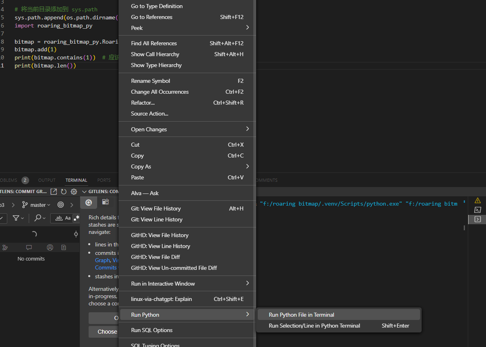

第十六周作业：
使用 pyo3 为其提供接口，供 python 使用
在terminal中安装pip和maturin,输入maturin build后，在terminal文件夹中输入：
python -m venv .venv
.venv\Scripts\activate
maturin develop 
之后可以在usage.py中运行代码，（import roaring_bitmap_py）
如下图所示：
